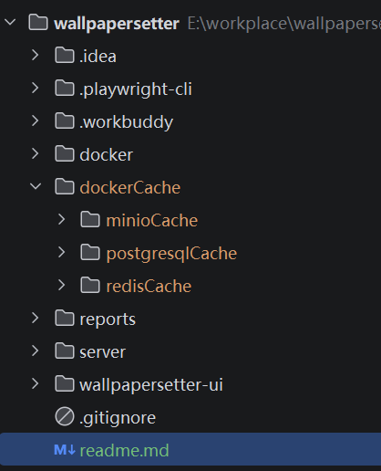

# 启动
1 创建缓存目录

新增dockerCache下的三个目录，保证为空

2 依次执行
```
cd docker
cp .env.example .env
docker compose --profile prod up -d --build
```

# 坑
1 windows 使用CRLF换行符会有问题

2 之前设置过相关的设置可能会有问题，如对象存储库的账号密码等。具体看docker的log

3 网速过慢挂梯子开tun模式